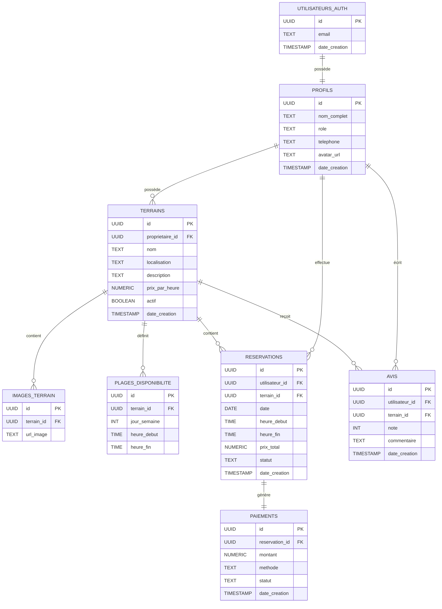

# Diagramme ERD de l'application FootBooking

```mermaid
erDiagram
    UTILISATEURS_AUTH {
        UUID id PK
        TEXT email
        TIMESTAMP date_creation
    }

    PROFILS {
        UUID id PK
        TEXT nom_complet
        TEXT role
        TEXT telephone
        TEXT avatar_url
        TIMESTAMP date_creation
    }

    TERRAINS {
        UUID id PK
        UUID proprietaire_id FK
        TEXT nom
        TEXT localisation
        TEXT description
        NUMERIC prix_par_heure
        BOOLEAN actif
        TIMESTAMP date_creation
    }

    IMAGES_TERRAIN {
        UUID id PK
        UUID terrain_id FK
        TEXT url_image
    }

    PLAGES_DISPONIBILITE {
        UUID id PK
        UUID terrain_id FK
        INT jour_semaine
        TIME heure_debut
        TIME heure_fin
    }

    RESERVATIONS {
        UUID id PK
        UUID utilisateur_id FK
        UUID terrain_id FK
        DATE date
        TIME heure_debut
        TIME heure_fin
        NUMERIC prix_total
        TEXT statut
        TIMESTAMP date_creation
    }

    AVIS {
        UUID id PK
        UUID utilisateur_id FK
        UUID terrain_id FK
        INT note
        TEXT commentaire
        TIMESTAMP date_creation
    }

    PAIEMENTS {
        UUID id PK
        UUID reservation_id FK
        NUMERIC montant
        TEXT methode
        TEXT statut
        TIMESTAMP date_creation
    }

    UTILISATEURS_AUTH ||--|| PROFILS : "possède"
    PROFILS ||--o{ TERRAINS : "possède"
    PROFILS ||--o{ RESERVATIONS : "effectue"
    PROFILS ||--o{ AVIS : "écrit"

    TERRAINS ||--o{ RESERVATIONS : "contient"
    TERRAINS ||--o{ AVIS : "reçoit"
    TERRAINS ||--o{ IMAGES_TERRAIN : "contient"
    TERRAINS ||--o{ PLAGES_DISPONIBILITE : "définit"

    RESERVATIONS ||--|| PAIEMENTS : "génère"
```
